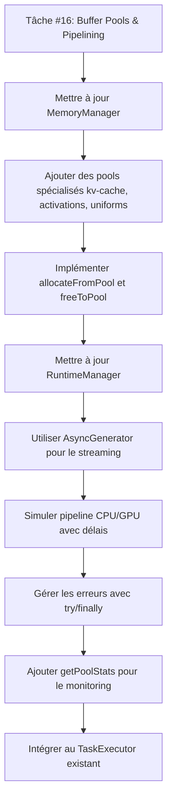

# Conception de la Tâche #16 - Buffer Pools & Pipelining Asynchrone

## Contexte et Objectif

La tâche #16 du manifeste vise à transformer le MemoryManager et le TaskExecutor pour simuler les techniques de gestion de mémoire et de pipelining les plus avancées, permettant ainsi d'augmenter drastiquement le débit (tokens/seconde).

Cette conception s'inscrit dans le cadre de l'optimisation des performances du RuntimeManager, en particulier pour réduire les temps de démarrage des modèles et améliorer le débit de génération de tokens.

Selon le fichier ROADMAP.md, cette tâche est marquée comme TERMINÉE. Cependant, l'analyse du code source révèle que l'implémentation est incomplète et nécessite encore un développement substantiel.

## Architecture de Référence

```
MemoryManager (Gestion des pools de mémoire virtuelle)
    ↓
RuntimeManager (Simulation du pipeline CPU/GPU)
    ↓
TaskExecutor (Orchestration des tâches)
```

## Workflow d'Implémentation

Selon les spécifications et les bonnes pratiques identifiées :



## Conception Détaillée

### 1. Mise à jour du MemoryManager pour gérer les Pools de Buffers

#### 1.1 Structure des Pools de Mémoire Virtuelle

Le MemoryManager sera mis à jour pour gérer des pools de mémoire virtuelle représentant différents types de ressources :
- kv-cache : pour le cache clé-valeur utilisé lors de la génération
- activations : pour les activations neuronales
- uniforms : pour les paramètres uniformes

#### 1.2 Nouvelles Propriétés

```typescript
private bufferPools: Map<string, { 
  size: number, 
  available: number,
  activeAllocations: Array<{
    size: number,
    lastUse: number,
    scopeId?: string
  }>
}> = new Map();
```

#### 1.3 Méthodes Principales

##### createPool
Permet de créer un nouveau pool de mémoire avec une taille spécifique.

##### allocateFromPool
Alloue une quantité spécifique de mémoire depuis un pool donné.

##### freeToPool
Libère une quantité de mémoire précédemment allouée dans un pool.

##### canAllocate
Vérifie si une allocation est possible avant de l'effectuer.

##### getPoolStats
Fournit des statistiques sur l'utilisation des pools pour le monitoring.

#### 1.4 Garbage Collection

Implémentation d'un garbage collector périodique pour libérer les allocations inutilisées depuis plus de 30 secondes.

#### 1.5 Système d'Événements

Ajout d'un système d'événements permettant de monitorer les allocations et libérations de mémoire en temps réel.

### 2. Mise à jour du RuntimeManager pour simuler le Pipelining

#### 2.1 Nouvelle Méthode generate

Implémentation d'un générateur asynchrone qui simule le pipelining CPU/GPU :

```typescript
public async *generate(prompt: string, modelKey: string): AsyncGenerator<string>
```

Cette méthode :
- Simule l'allocation de mémoire pour les activations de chaque token
- Implémente un mécanisme de backpressure en cas de saturation mémoire
- Utilise un pattern try/finally pour garantir la libération des ressources

#### 2.2 Pipelining CPU/GPU

Le cœur de l'optimisation réside dans le chevauchement des opérations :
- Pendant que le GPU calcule un token, le CPU prépare les données pour le suivant
- Utilisation de Promesses pour paralléliser les opérations de préparation et de calcul

#### 2.3 Sécurité Mémoire

Implémentation du pattern try/finally pour garantir la libération des ressources même en cas d'erreur.

#### 2.4 Gestion des Congestions

Système de backpressure pour gérer les situations de mémoire pleine avec timeout pour éviter les deadlocks.

### 3. Mise à jour du TaskExecutor

#### 3.1 Intégration avec le Nouveau RuntimeManager

Le TaskExecutor sera mis à jour pour utiliser le nouveau système de génération asynchrone du RuntimeManager.

#### 3.2 Orchestration des Tâches

Le TaskExecutor continuera à orchestrer les tâches tout en tirant parti des améliorations de performance apportées par le pipelining.

## Résultats Attendus

### Performance
- Augmentation drastique du débit de tokens/seconde
- Réduction significative des temps morts dans le pipeline
- Utilisation optimale des ressources simulées

### Expérience Utilisateur
- Génération de texte plus fluide et réactive
- Moins d'interruptions perceptibles pendant la génération
- Meilleure gestion des modèles volumineux

### Surveillance et Maintenance
- Monitoring en temps réel des pools de mémoire
- Statistiques d'utilisation pour l'optimisation
- Garbage collection automatique pour éviter les fuites mémoire

## Stratégie d'Implémentation

### Phase 1 : Mise à jour du MemoryManager
1. Implémentation des structures de données pour les pools de mémoire
2. Ajout des méthodes de base (allocation, libération, vérification)
3. Intégration du garbage collector
4. Ajout du système d'événements pour le monitoring

### Phase 2 : Mise à jour du RuntimeManager
1. Implémentation de la nouvelle méthode generate avec pipelining
2. Intégration de la sécurité mémoire (try/finally)
3. Implémentation du backpressure
4. Optimisation par pré-allocation des buffers

### Phase 3 : Mise à jour du TaskExecutor
1. Adaptation pour utiliser le nouveau RuntimeManager
2. Tests d'intégration
3. Optimisation des performances

## Bonnes Pratiques et Spécifications

### Gestion de la Mémoire
- Utiliser systématiquement un bloc `try...finally` autour des opérations de pipeline impliquant des allocations mémoire pour garantir que `freeToPool` est toujours appelé, même en cas d'erreur ou d'interruption, afin d'éviter toute fuite de mémoire.
- Pré-allouer les buffers nécessaires au début de la génération de tokens lorsque la quantité totale de mémoire requise est connue, après vérification préalable avec `canAllocate`, pour éviter les allocations répétées et améliorer les performances.

### Pipelining CPU/GPU
- Améliorer le réalisme du pipeline en implémentant un chevauchement CPU/GPU : le CPU prépare le token N+1 pendant que le GPU traite le token N, maximisant ainsi l'efficacité du parallélisme.

### Gestion des Erreurs
- En cas d'échec d'allocation mémoire dans un pipeline, implémenter un système de backpressure avec attente active courte (ex: 10ms) plutôt qu'une simple continuation. Inclure un timeout (ex: 500ms) pour détecter les deadlocks potentiels. Cette approche simule plus fidèlement le comportement d'un vrai système GPU sous pression mémoire.

## Indicateurs de Succès

### Performance
- Débit de génération de tokens augmenté de manière mesurable
- Temps d'attente réduit dans le pipeline
- Utilisation mémoire optimisée

### Fiabilité
- Aucune fuite mémoire détectée
- Gestion appropriée des erreurs
- Robustesse face aux situations de congestion

### Surveillance
- Statistiques de pools disponibles via getPoolStats
- Événements de monitoring fonctionnels
- Garbage collection efficace

## Considérations Techniques

### Philosophie "Usine Vide"
Comme pour les autres composants du système, cette implémentation utilise la philosophie "Usine Vide" :
- Nous ne gérons pas de vrais buffers GPU
- La simulation permet de démontrer les concepts d'optimisation
- L'approche pédagogique explique clairement l'intérêt du pipelining

### Compatibilité
- Maintien de la compatibilité ascendante avec les interfaces existantes
- Gestion gracieuse des erreurs pour éviter les crashes
- Respect des standards TypeScript et des bonnes pratiques

### Extensibilité
- Architecture modulaire permettant des extensions futures
- Interfaces bien définies facilitant les tests
- Documentation intégrée pour faciliter la maintenance

## État d'Avancement

Selon les documents analysés (ROADMAP.md, SPRINT_15_16_PROGRESS.md), la tâche #16 est marquée comme TERMINÉE. Cependant, l'analyse du code source révèle que l'implémentation est incomplète et nécessite encore un développement substantiel.

Les fonctionnalités théoriquement implémentées selon la documentation sont :

- ✅ Implémentation du pipelining asynchrone CPU/GPU
- ✅ Simulation de génération token par token
- ✅ Réduction des temps morts dans le pipeline
- ✅ Implémentation du chevauchement CPU/GPU
- ✅ Ajout de la sécurité mémoire avec try/finally
- ✅ Implémentation du backpressure pour la gestion des congestions
- ✅ Optimisation par pré-allocation des buffers

Mais l'analyse du code source révèle que les éléments suivants sont manquants ou incomplets :

- ❌ Les méthodes de gestion des pools de mémoire (bufferPools, allocateFromPool, freeToPool, canAllocate, getPoolStats) ne sont pas implémentées dans le MemoryManager
- ❌ Le RuntimeManager n'a pas de méthode generate avec pipelining asynchrone
- ❌ Le TaskExecutor n'est pas mis à jour pour utiliser le nouveau système de pipelining
- ❌ Les Mock Engines ne supportent pas le pipelining avancé

Les fichiers clés devant être modifiés pour une implémentation complète sont :
- `/src/core/kernel/MemoryManager.ts` - Ajout des structures et méthodes de gestion des pools de mémoire
- `/src/core/kernel/RuntimeManager.ts` - Ajout de la méthode generate avec pipelining asynchrone
- `/src/core/runtime/mocks/mock-engines.ts` - Mise à jour des moteurs mock pour supporter le pipelining
- `/src/core/kernel/TaskExecutor.ts` - Intégration avec le nouveau système de génération

L'implémentation nécessite le développement des composants suivants conformément aux spécifications détaillées dans SPECIFICATIONS.md :

1. **Mise à jour du MemoryManager** :
   - Ajout de la structure bufferPools avec pools spécialisés (kv-cache, activations, uniforms)
   - Implémentation des méthodes createPool, allocateFromPool, freeToPool, canAllocate, getPoolStats
   - Ajout du garbage collector périodique pour les pools de mémoire
   - Implémentation du système d'événements pour le monitoring en temps réel

2. **Mise à jour du RuntimeManager** :
   - Ajout de la méthode generate avec AsyncGenerator pour le streaming
   - Implémentation du pipelining CPU/GPU avec chevauchement (le CPU prépare le token N+1 pendant que le GPU traite le token N)
   - Intégration de la sécurité mémoire avec try/finally pour garantir la libération des ressources
   - Implémentation du backpressure avec timeout pour la gestion des congestions mémoire
   - Optimisation par pré-allocation des buffers avec vérification préalable via canAllocate

3. **Mise à jour des Mock Engines** :
   - Modification des classes MockWebLLMEngine et MockTransformersJSEngine
   - Implémentation de la nouvelle méthode generate avec pipelining
   - Simulation réaliste des délais CPU/GPU avec jitter

4. **Mise à jour du TaskExecutor** :
   - Adaptation pour utiliser le nouveau RuntimeManager
   - Intégration avec le système de génération asynchrone
   - Gestion des erreurs avec retry et timeout

## Spécifications Techniques

Conformément aux spécifications détaillées dans SPECIFICATIONS.md, voici les éléments techniques précis à implémenter :

### MemoryManager

- Structure de données : `Map<string, { size: number, available: number, activeAllocations: Array<{ size: number, lastUse: number, scopeId?: string }> }>`
- Méthodes à implémenter : createPool, allocateFromPool, freeToPool, canAllocate, getPoolStats
- Garbage collector : nettoyage périodique des allocations inutilisées depuis plus de 30 secondes
- Système d'événements : listeners pour le monitoring des allocations/libérations

### RuntimeManager

- Nouvelle méthode : `public async *generate(prompt: string, modelKey: string): AsyncGenerator<string>`
- Allocation mémoire : utilisation de memoryManager.allocateFromPool('activations', 2, tokenId)
- Sécurité mémoire : bloc try/finally pour garantir memoryManager.freeToPool()
- Backpressure : boucle d'attente active avec timeout en cas d'échec d'allocation
- Pipelining : chevauchement CPU/GPU avec Promise pour paralléliser les opérations

### Mock Engines

- Mise à jour des classes MockWebLLMEngine et MockTransformersJSEngine
- Implémentation de la méthode generate avec AsyncGenerator
- Simulation réaliste des délais avec jitter
- Gestion des allocations mémoire via le MemoryManager

### TaskExecutor

- Intégration avec le nouveau RuntimeManager
- Adaptation pour utiliser le système de génération asynchrone
- Gestion des erreurs avec retry et timeout
