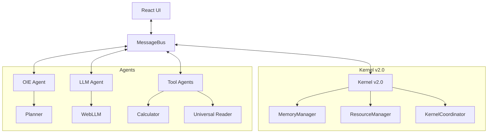

# 🏛️ Kensho Architecture

> **Theory & Design Principles**

This document provides a high-level overview of the Kensho system architecture. It explains the "Why" and "How" behind the design decisions, the core patterns used, and how the different components interact.

---

## 1. Core Concepts

### 1.1. Local-First AI
Kensho is designed to run **entirely in the browser**.
- **Privacy**: No data leaves the user's device unless explicitly requested (e.g., for external API calls).
- **Latency**: Zero network latency for inference once the model is loaded.
- **Offline Capable**: Works without an internet connection after initial assets are cached.

### 1.2. Distributed Multi-Agent System
Instead of a single monolithic AI, Kensho uses a swarm of specialized agents.
- **Specialization**: Each agent does one thing well (Math, RAG, Planning, etc.).
- **Isolation**: Agents run in separate Web Workers to prevent UI freezing and crash propagation.
- **Orchestration**: A central "brain" (OIE) coordinates these agents to solve complex tasks.

---

## 2. System Overview

The system is built around a central **MessageBus** that connects the UI, the Core Kernel, and the Agents.



---

### 3. The MessageBus Pattern

The **MessageBus** (`src/core/communication/MessageBus.ts`) is the central nervous system. It is not just a pipe; it is a smart router with middleware.

#### 3.1. Internal Architecture
The Bus is composed of several specialized managers:
-   **RequestManager**: Handles the lifecycle of RPC calls. It maps `messageId` to pending Promises and handles timeouts.
-   **StreamManager**: Manages long-lived connections for streaming data (tokens). It handles `chunk`, `end`, `error`, and `cancel` events.
-   **DuplicateDetector**: Ensures **Idempotency**. It remembers processed `messageId`s to prevent double-execution, which is critical in a distributed system where messages might be retried.
-   **MessageRouter**: Dispatches messages to the correct handler (`onRequest`, `onResponse`, `onBroadcast`) based on the message type.

#### 3.2. Communication Flow
1.  **Sender** calls `bus.request('target', 'method', payload)`.
2.  **Bus** wraps it in a `KenshoMessage` with a unique UUID.
3.  **Transport** (e.g., `BroadcastTransport`) serializes and sends it.
4.  **Receiver Transport** deserializes it.
5.  **Receiver Bus** checks `DuplicateDetector`.
6.  **Router** sends it to the registered handler.
7.  **Handler** executes and returns a result.
8.  **Bus** sends a `Response` message back.

#### 3.3. Transports
-   **BroadcastTransport**: Uses the `BroadcastChannel` API. It is "connectionless" and perfect for multi-tab synchronization.
-   **WebSocketTransport**: Maintains a persistent connection to a Relay Server. It handles reconnection logic and heartbeats.
-   **HybridTransport**: The smartest transport. It tries to route locally first. If the target is not found (timeout), it forwards the message to the WebSocket.

---

## 4. Kernel v2.0 (The Engine)

The Kernel (`src/core/kernel/`) is the "Operating System" layer of Kensho. It abstracts the browser's hardware constraints.

### 4.1. MemoryManager (The VRAM Guardian)
-   **Problem**: Loading a 4GB LLM into a browser with only 2GB VRAM crashes the tab instantly.
-   **Solution**: `MemoryManager` uses **WebGPU** (`navigator.gpu.requestAdapter`) to query the *real* hardware limits.
-   **Bundle Caching**: It persists the size of downloaded models in `localStorage` (`kensho_bundle_sizes_v1`) to make smarter decisions on the next boot without re-downloading.
-   **Safety Margin**: It enforces a 15% safety margin to leave room for the browser's UI and other tabs.

### 4.2. ResourceManager (The Senses)
-   **Monitoring**: It polls system status every 500ms.
    -   **Memory Trend**: Calculates a moving average of JS Heap usage to detect leaks (`stable` | `rising` | `falling`).
    -   **Network Quality**: Uses `navigator.connection.downlink` and `rtt` to classify the network.
    -   **Thermal Throttling**: Heuristic-based detection (if CPU is pegged but tasks slow down).
-   **Reactivity**: It emits events like `battery-low` (< 15%) or `network-offline` which trigger the `KernelCoordinator` to switch strategies (e.g., pause background sync).

### 4.3. KernelCoordinator (The Conductor)
-   **Orchestration**: It is the only component allowed to authorize a model load.
-   **Decision Matrix**:
    ```
    IF (VRAM_Available > Model_Size * 1.2) AND (Battery > 20%) AND (Not Thermal_Throttling)
    THEN Allow_Load
    ELSE Reject_Load("Insufficient Resources")
    ```

---

## 5. Agent System

### 5.1. OIE (Orchestrateur Intelligent d'Exécution)
The OIE is the "Manager" agent.
-   **Input**: A complex user query (e.g., "Read this PDF and calculate the total cost").
-   **Process**:
    1.  **Planning**: Uses an LLM to break the task into steps.
    2.  **Delegation**: Assigns steps to specialized agents (Reader, Calculator).
    3.  **Synthesis**: Combines results into a final answer.

### 5.2. LLM Agent
Wraps **WebLLM** (@mlc-ai/web-llm).
-   **Models**: Supports Phi-3, Qwen-2, Gemma-2.
-   **Features**: Streaming, JSON mode, Context caching.

### 5.3. Universal Reader
-   **Capabilities**: Parsing PDF, TXT, Markdown.
-   **Privacy**: Parsing happens locally in the browser.

---

## 6. Security Architecture

### 6.1. Isolation
-   Agents run in **Web Workers**. They have no access to the DOM or localStorage (unless via MessageBus).
-   Sandboxing ensures that a compromised agent cannot easily steal session data.

### 6.2. Validation
-   **Zod Schemas**: Every message passing through the Bus is validated against strict schemas.
-   **Sanitization**: Inputs and outputs are sanitized to prevent XSS.

### 6.3. Rate Limiting
-   The **OrionGuardian** component monitors message traffic and can cut off "spammy" agents (Circuit Breaker pattern).

---

## 7. Data Persistence

### 7.1. IndexedDB
Used for large data storage:
-   Conversation history.
-   Vector embeddings (for RAG).
-   Cached model weights.

### 7.2. LocalStorage
Used for lightweight config:
-   User preferences.
-   Theme settings.
-   Feature flags.

---

*For implementation details, see [DEVELOPER_GUIDE.md](./DEVELOPER_GUIDE.md).*
